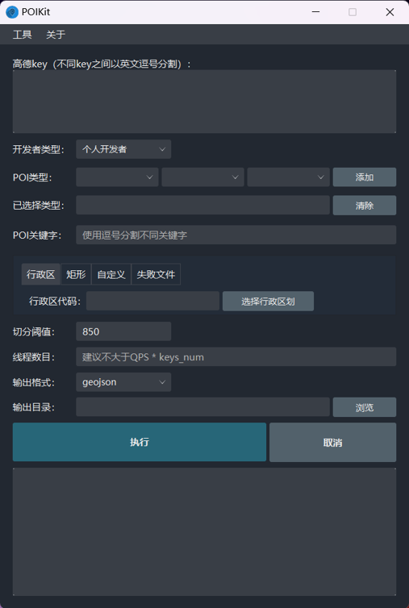
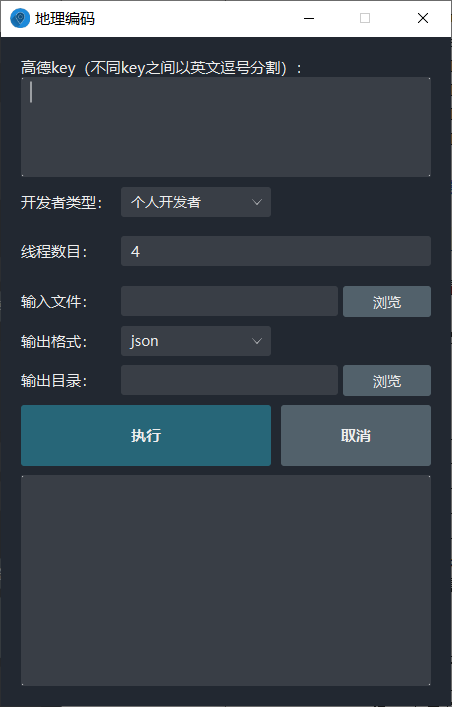

## 概述

受[OSpider](https:/github.com/skytruine/OSpider)启发，使用JavaFX开发高德POI数据获取软件，同时，计划支持GIS常用工具如地理编码、geojson/shp转换等。

version： 0.0.1

功能：POI搜索、地理编码

运行环境：jdk/jre 1.8

## POI搜索功能

高德POI检索功能每次请求最多返回1000个POI信息，为获得全量POI信息，特开发该工具

1. 高德key：支持多key，不同key之间以英文逗号分割；
2. POI关键字：查询关键字，如KFC、厕所；
3. POI类型：[POI类型表](https://lbs.amap.com/api/webservice/download)
4. 区域
    + 行政区：[行政区六位代码](http://www.mca.gov.cn//article/sj/xzqh/2020/202006/202008310601.shtml)
    + 矩形：格式为左上角经纬度#右下角经纬度，如133,34#135,30
    + 自定义：支持geojson格式自定义区域

5. 初始网格数：网格剖分数目，一般而言，该值越大，运行越慢，POI数量越大；
6. 阈值：当网格POI数量超出阈值，会对该网格进一步四分；
7. 线程数目：支持多线程爬取，线程数量一般不大于QPS * keys_num * 0.1；
8. 输出格式，支持geojson、csv、txt三种格式；
9. 输出目录：结果保存路径；
10. 执行：点击执行，程序将开始爬取POI；
11. 取消：点击取消，程序将中断爬取POI。

POI检索结果包括gcj02和wgs84两种坐标，若导出为geojson，则使用wgs84坐标。

## 地理编码功能

1. 高德key：支持多key，不同key之间以英文逗号分割；
2. 线程数目：支持多线程爬取，线程数量一般不大于QPS * keys_num * 0.1；
3. 输入文件：输入文件格式必须为csv或txt，且至少包含address字段；
4. 输出格式，支持json、csv、txt三种格式；
5. 输出目录：结果保存路径；
10. 执行：点击执行，程序将开始地理编码；
11. 取消：点击取消，程序将中断地理编码。

地理编码结果包括gcj02和wgs84两种坐标。
