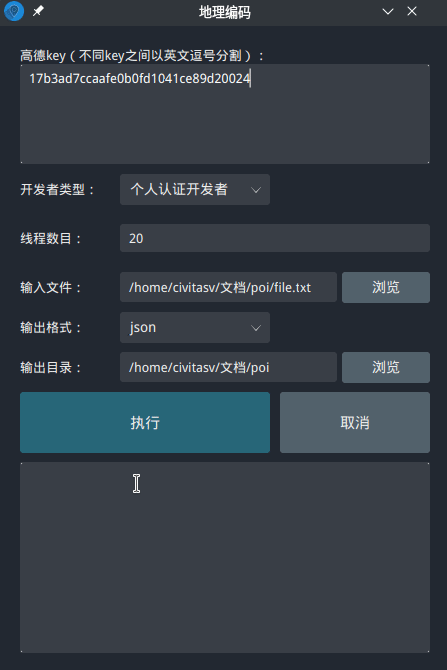

# POIKit

[](https://github.com/Civitasv/AMapPoi)
[](https://github.com/Civitasv/AMapPoi/graphs/commit-activity)
[](https://github.com/Civitasv/AMapPoi/releases/latest)

POIKit 目的是提供一套简单易用且稳定的 POI 获取与处理工具套件，方便 GIS 相关从业者。目前软件处于初步构建状态，希望各位多多尝试，多多提问题（The More Questions，The Better）。

## 目录

- [功能演示](#功能演示)

- [安装](#安装)

- [技术选型](#技术选型)

- [维护人员](#维护人员)

- [支持该项目](#支持该项目)

- [开发路线](#开发路线)

- [License](#License)

## 功能演示

### POI 搜索功能

以行政区为例。POI 类型：餐饮服务；行政区：371723；初始网格数：4；阈值：850；线程数目：2；输出格式：csv，POI 搜索功能如下所示：


**功能配置参数如下表：**

|    参数    |                                                    说明                                                     |                                                 注意                                                  |
| :--------: | :---------------------------------------------------------------------------------------------------------: | :---------------------------------------------------------------------------------------------------: |
|  高德 key  |                                软件支持多个 key，不同 key 之间需要用逗号分割                                |                         注意，只能使用**英文逗号**，且不能包含换行符、空格等                          |
| 开发者类型 |                                   个人开发者或个人认证开发者或企业开发者                                    |           用于设置 QPS 值，当用户设置线程数大于最大线程数，将强制设为最大线程，防止过高并发           |
| POI 关键字 |                              搜索关键字，如**KFC**，不同关键字之间使用逗号分割                              |                                       只能使用**英文逗号** 分割                                       |
|  POI 类型  |                                        搜索类型，可为分类代码或汉字                                         | 若使用汉字，必须严格按照[高德 POI 分类编码](https://lbs.amap.com/api/webservice/download)中的汉字编写 |
|   行政区   |           [行政区六位代码](http://www.mca.gov.cn//article/sj/xzqh/2020/202006/202008310601.shtml)           |                                                   -                                                   |
|    矩形    |                         格式严格遵循左上角经纬度#右下角经纬度，如**133,34#135,30**                          |                        经纬度坐标需要使用**GCJ02 坐标**，只能使用**英文逗号**                         |
|   自定义   |                                        支持用户上传 geojson 边界文件                                        |                     经纬度坐标需要使用**GCJ02 坐标**，类型必须为**MultiPolygon**                      |
| 初始网格数 |                                              初始网格剖分数目                                               |                                       一般情况按默认值为 4 即可                                       |
|    阈值    |                                当该网格 POI 数量超出阈值，会对网格进一步四分                                |                                         一般情况下按 850 即可                                         |
|  线程数目  | 线程数量一般不大于 QPS - keys_num - 0.1，个人开发者最多设为 2，个人认证开发者最多设为 5，网速较快时也应降低 |        QPS 可以在[流量限制说明](https://lbs.amap.com/api/webservice/guide/tools/flowlevel)查看        |
|  输出格式  |                                     目前支持 geojson、**shp**、csv、txt                                     |            结果包含 gcj02 和 wgs84 两种坐标，若输出格式为 geojson 或 shp，使用 wgs84 坐标             |

**注意：**

1. **行政区、矩形和用户自定义文件爬取结果为该区域的外接矩形的 POI，因此，除矩形区域检索外，其它方式均需要使用 ArcGIS 裁切工具将区域外的 POI 进行筛除！**

2. **若爬取过程中 key 池额度用尽，软件会停止爬取，但不会删除之前爬取得到的数据，仍会导出。**

3. **若爬取过程中，用户点击取消，软件会停止爬取，但不会删除之前爬取得到的数据，仍会导出。**

**输出参数说明：**

|   参数    |       说明       |
| :-------: | :--------------: |
|   name    |       名称       |
|   type    |    兴趣点类型    |
| typecode  |  兴趣点类型编码  |
|  address  |       地址       |
|   pname   | POI 所在省份名称 |
| cityname  |      城市名      |
|  adname   |     区域名称     |
| gcj02_lon |    gcj02 经度    |
| gcj02_lat |    gcj02 纬度    |
| wgs84_lon |    wgs84 经度    |
| wgs84_lat |    wgs84 纬度    |

### 地理编码功能

以 txt 文件为例：

```txt
city,address
武汉市,武汉大学资源与环境科学学院
武汉市,珞狮路63号
武汉市,珞喻路与珞狮路交叉口
襄阳市,诸葛亮广场水上世界市
```

运行演示如下：



**功能配置参数如下表所示：**

|    参数    |                                                        说明                                                         |                                          注意                                           |
| :--------: | :-----------------------------------------------------------------------------------------------------------------: | :-------------------------------------------------------------------------------------: |
|  高德 key  |                                    软件支持多个 key，不同 key 之间需要用逗号分割                                    |                  注意，只能使用**英文逗号**，且不能包含换行符、空格等                   |
| 开发者类型 |                                       个人开发者或个人认证开发者或企业开发者                                        |    用于设置 QPS 值，当用户设置线程数大于最大线程数，将强制设为最大线程，防止过高并发    |
|  线程数目  | 线程数量一般不大于 QPS - keys_num - 0.1，个人开发者最多设为 2，个人认证开发者最多设为 5，网速较快时也应降低线程数目 | [QPS 可以在流量限制说明查看](https://lbs.amap.com/api/webservice/guide/tools/flowlevel) |
|  输入文件  |                                              支持 csv 或 txt 格式文件                                               |                               至少需要包含**address**字段                               |
|  输出目录  |                             结果输出路径，目前地理编码结果包括 gcj02 和 wgs84 两种坐标                              |                                            -                                            |

**注意：**

**若地理编码过程中，用户点击取消，软件会停止爬取，但不会删除之前爬取得到的数据，仍会导出。**

**输出参数说明：**

|       参数        |       说明       |
| :---------------: | :--------------: |
| formatted_address |  结构化地址信息  |
|      country      |       国家       |
|     province      | 地址所在的省份名 |
|       city        | 地址所在的省份名 |
|     citycode      |     城市编码     |
|     district      |   地址所在的区   |
|      adcode       |     区域编码     |
|      street       |       街道       |
|      number       |       门牌       |
|       level       |     匹配级别     |
|     gcj02_lon     |    gcj02 经度    |
|     gcj02_lat     |    gcj02 纬度    |
|     wgs84_lon     |    wgs84 经度    |
|     wgs84_lat     |    wgs84 纬度    |

## 安装

1. 软件基于 Java 环境运行，需要首先安装 jre/jdk（1.8 版本），安装步骤如下：
   - 下载[JDK8](https://www.oracle.com/java/technologies/javase/javase-jdk8-downloads.html)，选择适合本系统的版本；
   - 配置环境变量`JAVA_HOME`为安装目录，然后在`Path`中添加`%JAVA_HOME%\bin`；
   - 打开终端，输入`java -version`，若出现 Java 版本号，则配置成功。
2. [下载](https://github.com/Civitasv/AMapPoi/releases/latest)最新发布的软件压缩包，以`POIKit.zip`为例，解压缩后，双击`start.bat`即可运行。

## 技术选型

目前软件采用 MVC 软件架构模式，技术选型如下：

- GUI：[JavaFX 8](https://openjfx.io/)；
- HTTP 请求：[Retrofit](https://square.github.io/retrofit/)
- Json 转换：[Gson](https://github.com/google/gson)

## 维护人员

[@Civitasv](https://github.com/Civitasv)

## 支持该项目

若遇到任何问题，你可以通过以下方式联系我：

1. 邮箱：sen.hu@whu.edu.cn，我会定时查看邮箱，但不保证实时性；
2. 用户 QQ 群：939504570
3. 提 [issue](https://github.com/Civitasv/AMapPoi/issues)：这是我推荐的方式，有问题时，也应该首先查看 issue 列表是否已有该问题的解答；

若帮助到了您，[Github Star](https://github.com/Civitasv/AMapPoi) 是对我最大的肯定。

## 开发路线

- **v0.0.1** 2021-04-20
  - 初步实现软件及安装文档；
- **v0.0.2** 2021-04-22
  - 修复重复 bug；
- **v0.0.3** 2021-04-23
  - 线程池运行优化；
  - 添加运行状态提示
- **v0.0.4-alpha** 2021-04-23
  - 添加 POI 检索[错误码](https://lbs.amap.com/api/webservice/guide/tools/info)输出；
  - 修改地理编码返回字段;
  - 添加开发者类型选择下拉框，防止过高并发；
  - 解决点击“执行按钮”卡顿 bug;
  - **【重要更新】POI 搜索添加导出 shp 功能**

## License

[MIT](LICENSE) © Civitasv
